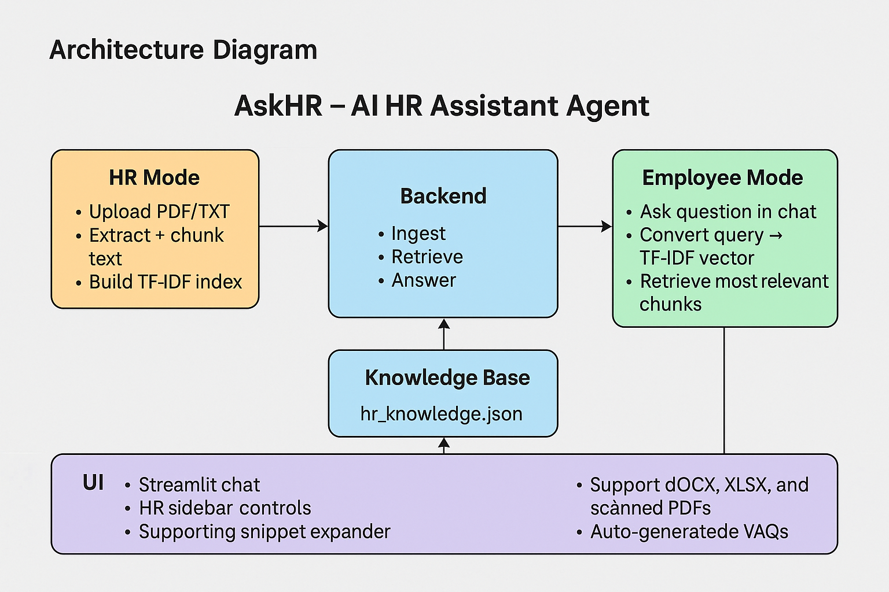

# AskHR – AI HR Assistant Agent

## Overview

AskHR is an AI-powered HR Assistant that helps employees instantly find answers
about leave, work-from-home policy, notice period, holidays, and other HR rules
by searching through HR policy documents.

HR can upload policy files (PDF / TXT), and employees can then ask questions in
natural language like:

- "How many casual leaves are allowed per year?"
- "What is the notice period after confirmation?"
- "How many work-from-home days are allowed per month?"

AskHR searches the policies, finds the most relevant section, and shows it as
the answer along with the original supporting text.

This project was built for the  
**AI Agent Development Challenge – Category: HR Assistant Agent**.

---

## Features

- 🧾 **HR Policy Upload (HR Mode)**
  - Upload one or more PDF/TXT documents.
  - Automatic text extraction and chunking.

- 🔍 **Semantic Search (Offline & Free)**
  - TF-IDF + Cosine similarity for relevant answer retrieval.

- 💬 **Chat-style Q&A Interface**
  - Employees ask questions in natural language.
  - Assistant returns the top relevant policy text.

- 🔄 **HR / Employee Mode Switch**
  - HR Mode → upload, build KB, clear KB.
  - Employee Mode → chat only.

- 🧠 **Persistent Knowledge Base**
  - Stored in `data/hr_knowledge.json`.

- 🧹 **Clear Knowledge Base**
  - HR can clear and rebuild policies anytime.

---

## Tech Stack

- **Python**
- **Streamlit** – UI
- **Scikit-learn** – TF-IDF retrieval
- **NumPy**
- **PyPDF2**
- **JSON** storage

---

## Architecture

### 1. HR Mode
- Upload PDF/TXT files  
- Extract text and chunk  
- Build TF-IDF index  
- Save to `data/hr_knowledge.json`

### 2. Employee Mode
- User asks a question  
- Convert query to TF-IDF  
- Retrieve top chunks  
- Assistant returns summarized answer  

### 3. UI
- Streamlit chat interface  
- HR controls in sidebar  
- Supporting text snippets  



---

## Project Structure

```text
askhr-agent/
├── app.py                        # Streamlit app (HR & Employee modes)
│
├── backend/                      # Backend processing modules
│   ├── ingest.py                 # PDF/TXT extraction + text chunking
│   ├── retrieval.py              # TF-IDF index + persistent storage
│   ├── llm.py                    # Answer generation
│   ├── config.py                 # Reserved for future API keys
│   └── __init__.py
│
├── data/
│   └── hr_knowledge.json         # Persistent HR knowledge base (auto-created)
│
├── diagrams/
│   └── architecture.png          # System architecture diagram
│
├── requirements.txt              # Dependencies
├── README.md                     # Documentation
├── .gitignore                    # Files ignored by Git
└── .env.example                  # Environment variable template

Installation
1. Clone the repository
git clone https://github.com/Anupama-dev-create/askhr-agent.git

cd askhr-agent

2. Create and activate virtual environment
python -m venv venv
venv\Scripts\activate

3.Install dependencies
pip install -r requirements.txt
4.Running the App
streamlit run app.py


## How to Use

### 🔑 HR Mode
1. Switch sidebar mode to **HR**
2. Upload HR policy documents (PDF or TXT)
3. Click **Build / Refresh HR Knowledge Base**
4. Wait for the success message
5. The knowledge base is saved automatically
6. The chatbot is now ready to answer questions

You can also:
- **Clear Knowledge Base**
- Re-upload updated policies

---

### 👨‍💼 Employee Mode
1. Select **Employee** mode
2. Only the chatbot interface is visible
3. Ask HR-related questions such as:
   - “How many casual leaves per year?”
   - “What is the notice period?”
   - “How many WFH days are allowed?”

---

## Sample Questions
- “How many sick leaves do I get per year?”
- “Can I carry forward earned leave?”
- “What is the probation period?”
- “How many late marks are allowed monthly?”

---

## Limitations
- No OCR support (cannot read scanned/image PDFs)
- TF-IDF retrieval (basic semantic search)
- No separate login system for HR vs employees
- English-only policy documents
- Local JSON storage (not cloud-based)

---

## Future Enhancements
- Cloud LLM support (GPT / Gemini) for natural answers
- Admin login system  
- Vector database (Pinecone / Chroma)  
- Support DOCX, XLSX, and scanned PDFs  
- Analytics dashboard for HR  
- Auto-generated FAQs from employee questions  

---

## License
This project is created for the **AI Agent Development Challenge**  
and is free to use for educational and demonstration purposes.
